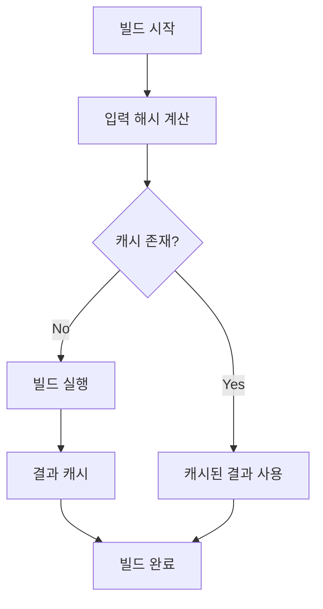

# Turborepo 캐시 설정 가이드

## 목차
- [개요](#개요)
- [원격 캐시 설정](#원격-캐시-설정)
- [GitHub Actions 설정](#github-actions-설정)
- [캐시 동작 방식](#캐시-동작-방식)
- [문제 해결](#문제-해결)
- [자체 Remote Cache Server 구축](#자체-remote-cache-server-구축)

## 개요

이 문서는 Turborepo를 사용하는 모노레포에서 빌드 성능을 최적화하기 위한 캐시 설정 방법을 설명합니다.

### 주요 기능
- Vercel 원격 캐시를 통한 팀 간 빌드 결과 공유
- GitHub Actions에서의 로컬 및 원격 캐시 활용
- 멀티 레벨 캐싱 전략을 통한 빌드 성능 최적화

## 원격 캐시 설정

### 1. Vercel 프로젝트 설정
```bash
# Vercel CLI를 통한 로그인
vercel login

# 프로젝트 연결
vercel link
```

### 2. 환경 변수 설정
필요한 환경 변수:
- `TURBO_TOKEN`: Vercel 인증 토큰
- `TURBO_TEAM`: Vercel 팀 ID
- `TURBO_REMOTE_CACHE_SIGNATURE_KEY`: 캐시 서명 키

### 3. turbo.json 설정
```json
{
  "$schema": "https://turbo.build/schema.json",
  "globalEnv": [
    "TURBO_TOKEN",
    "TURBO_TEAM",
    "TURBO_REMOTE_CACHE_SIGNATURE_KEY"
  ],
  "remoteCache": {
    "enabled": true,
    "signature": true,
    "apiUrl": "https://api.vercel.com"
  },
  "tasks": {
    "build": {
      "dependsOn": ["^build"],
      "outputs": [
        "dist/**",
        ".next/**",
        "!.next/cache/**"
      ],
      "env": [
        "TURBO_TOKEN",
        "TURBO_TEAM",
        "TURBO_REMOTE_CACHE_SIGNATURE_KEY"
      ]
    }
  }
}
```

## GitHub Actions 설정

### 1. Secrets 설정
GitHub 레포지토리의 Settings > Secrets and variables > Actions에서 다음 값들을 설정:
- `TURBO_TOKEN`
- `TURBO_TEAM`
- `TURBO_REMOTE_CACHE_SIGNATURE_KEY`

### 2. 워크플로우 구성
`.github/workflows/turbo-cache.yml` 파일의 주요 구성:

#### 기본 설정
```yaml
name: Build with Vercel Remote Cache

on:
  push:
    branches: [ main ]
  pull_request:
    branches: [ main ]

env:
  TURBO_TOKEN: ${{ secrets.TURBO_TOKEN }}
  TURBO_TEAM: ${{ secrets.TURBO_TEAM }}
  TURBO_REMOTE_CACHE_SIGNATURE_KEY: ${{ secrets.TURBO_REMOTE_CACHE_SIGNATURE_KEY }}
  TURBO_API: 'https://api.vercel.com'
```

#### 캐시 설정
```yaml
# pnpm 캐시
- name: Setup pnpm cache
  uses: actions/cache@v3
  with:
    path: |
      ${{ env.STORE_PATH }}
      node_modules
      */*/node_modules
    key: ${{ runner.os }}-pnpm-${{ hashFiles('**/pnpm-lock.yaml') }}

# Turbo 캐시
- name: Setup Turbo cache
  uses: actions/cache@v3
  with:
    path: |
      .turbo
      **/.turbo
    key: turbo-${{ github.job }}-${{ github.sha }}
```

## 캐시 동작 방식

### 캐시 레벨
1. **로컬 캐시**
   - `.turbo` 디렉토리에 저장
   - 워크스페이스별 빌드 결과 캐싱
   - GitHub Actions에서 job 간 공유

2. **원격 캐시**
   - Vercel 서버에 저장
   - 팀 구성원 간 공유
   - CI/CD 환경 간 공유

### 캐시 키 생성
- 입력 파일들의 해시값
- 환경 변수 값
- 의존성 정보
- 빌드 명령어

### 캐시 무효화 조건
- 소스 코드 변경
- 의존성 변경
- 환경 변수 변경
- 빌드 스크립트 변경

## 문제 해결

### 캐시 미스 발생 시
1. 환경 변수 확인
   ```bash
   echo $TURBO_TOKEN
   echo $TURBO_TEAM
   ```

2. 원격 캐시 연결 확인
   ```bash
   pnpm exec turbo build --dry
   ```

3. 캐시 수동 정리
   ```bash
   rm -rf .turbo
   rm -rf node_modules/.cache/turbo
   ```

### 일반적인 문제
1. **인증 오류**
   - Vercel 토큰 재발급
   - GitHub Secrets 업데이트

2. **캐시 불일치**
   - 로컬 캐시 삭제 후 재시도
   - `pnpm install` 재실행

3. **빌드 실패**
   - 로그에서 캐시 상태 확인
   - 의존성 트리 검사

## 참고 자료
- [Turborepo 공식 문서](https://turbo.build/repo/docs)
- [Vercel 원격 캐시 설정](https://vercel.com/docs/concepts/monorepos/remote-caching)
- [GitHub Actions 캐싱](https://docs.github.com/en/actions/using-workflows/caching-dependencies-to-speed-up-workflows)

## 원격 캐시 상세 설명

### 원격 캐시 작동 원리

1. **캐시 생성 과정**


2. **해시 계산 요소**
```typescript
interface HashInputs {
  // 소스 파일의 내용
  sourceFiles: string[];
  // package.json의 의존성
  dependencies: {
    name: string;
    version: string;
  }[];
  // 환경 변수 값
  environmentVars: string[];
  // 빌드 명령어와 옵션
  buildCommand: string;
}
```

### turbo.json 원격 캐시 설정 상세
```json
{
  // 스키마 정의
  "$schema": "https://turbo.build/schema.json",
  
  // 전역 환경 변수 설정
  "globalEnv": [
    "TURBO_TOKEN",      // Vercel API 인증 토큰
    "TURBO_TEAM",       // 팀 식별자
    "TURBO_REMOTE_CACHE_SIGNATURE_KEY"  // 캐시 무결성 검증 키
  ],
  
  // 원격 캐시 설정
  "remoteCache": {
    "enabled": true,    // 원격 캐시 활성화
    "signature": true,  // 캐시 서명 검증 활성화
    "apiUrl": "https://api.vercel.com"  // Vercel API 엔드포인트
  },
  
  // 태스크별 캐시 설정
  "tasks": {
    "build": {
      // 빌드 전 실행되어야 하는 의존성 태스크
      "dependsOn": ["^build"],
      
      // 캐시할 출력물 정의
      "outputs": [
        "dist/**",        // 빌드 결과물
        ".next/**",       // Next.js 빌드 결과물
        "!.next/cache/**" // 캐시에서 제외할 경로
      ],
      
      // 캐시 키 생성에 포함될 환경 변수
      "env": [
        "TURBO_TOKEN",
        "TURBO_TEAM",
        "TURBO_REMOTE_CACHE_SIGNATURE_KEY"
      ]
    }
  }
}
```

### GitHub Actions에서의 원격 캐시 활용

```yaml
# 원격 캐시 관련 환경 변수 설정
env:
  TURBO_TOKEN: ${{ secrets.TURBO_TOKEN }}           # Vercel API 접근 토큰
  TURBO_TEAM: ${{ secrets.TURBO_TEAM }}            # 팀 식별자
  TURBO_REMOTE_CACHE_SIGNATURE_KEY: ${{ secrets.TURBO_REMOTE_CACHE_SIGNATURE_KEY }}  # 캐시 서명 키
  TURBO_API: 'https://api.vercel.com'              # Vercel API 엔드포인트

jobs:
  build:
    steps:
      # ... 이전 단계들 ...

      # 빌드 전 원격 캐시 상태 확인
      - name: Check Remote Cache Status
        run: |
          echo "Checking remote cache status before build..."
          # --dry: 실제 빌드 없이 캐시 상태만 확인
          # --summarize: 상세 정보 출력
          pnpm exec turbo build --dry --summarize

      # 빌드 실행 (원격 캐시 활용)
      - name: Build
        run: pnpm exec turbo build --summarize
        env:
          TURBO_TOKEN: ${{ secrets.TURBO_TOKEN }}
          TURBO_TEAM: ${{ secrets.TURBO_TEAM }}
          TURBO_REMOTE_CACHE_SIGNATURE_KEY: ${{ secrets.TURBO_REMOTE_CACHE_SIGNATURE_KEY }}

      # 빌드 후 캐시 상태 검증
      - name: Verify Cache Status
        if: always()
        run: |
          echo "Verifying cache status after build..."
          pnpm exec turbo build --dry --summarize
```

### 원격 캐시 동작 시나리오

1. **최초 빌드 시**
   ```mermaid
   sequenceDiagram
       CI->>Vercel: 캐시 확인
       Vercel-->>CI: 캐시 없음
       CI->>CI: 전체 빌드 실행
       CI->>Vercel: 빌드 결과 캐시
   ```

2. **캐시 히트 시**
   ```mermaid
   sequenceDiagram
       CI->>Vercel: 캐시 확인
       Vercel-->>CI: 캐시 있음
       CI->>CI: 캐시된 결과 사용
       CI->>CI: 증분 빌드만 실행
   ```

### 원격 캐시 모니터링

1. **캐시 상태 확인**
   ```bash
   # 캐시 히트/미스 확인
   pnpm exec turbo build --dry

   # 상세 정보 확인
   pnpm exec turbo build --summarize

   # 특정 태스크의 캐시 정보만 확인
   pnpm exec turbo build --filter=<workspace> --dry
   ```

2. **캐시 성능 메트릭**
   - 캐시 히트율
   - 빌드 시간 절감
   - 원격 캐시 사용량 

## 자체 Remote Cache Server 구축

### 1. Turborepo Remote Cache Server 설정

#### 1.1 Docker를 사용한 설정

```dockerfile
# turbo-cache-server/Dockerfile
FROM node:18-alpine

WORKDIR /app

# Turborepo CLI 설치
RUN npm install -g turbo

# 캐시 저장소 디렉토리 생성
RUN mkdir -p /app/cache

# 환경 변수 설정
ENV TURBO_TOKEN=your-secret-token
ENV STORAGE_PROVIDER=fs
ENV STORAGE_PATH=/app/cache

# 서버 실행
EXPOSE 3000
CMD ["turbo", "daemon", "--port", "3000"]
```

```yaml
# turbo-cache-server/docker-compose.yml
version: '3'
services:
  turbo-cache:
    build: .
    ports:
      - "3000:3000"
    volumes:
      - turbo-cache-data:/app/cache
    environment:
      - TURBO_TOKEN=your-secret-token
      - STORAGE_PROVIDER=fs
      - STORAGE_PATH=/app/cache

volumes:
  turbo-cache-data:
```

#### 1.2 직접 실행 방법

```bash
# Turborepo CLI 전역 설치
npm install -g turbo

# 캐시 서버 실행
TURBO_TOKEN=your-secret-token STORAGE_PROVIDER=fs STORAGE_PATH=/path/to/cache turbo daemon --port 3000
```

### 2. 프로젝트 설정

#### 2.1 turbo.json 업데이트
```json
{
  "$schema": "https://turbo.build/schema.json",
  "remoteCache": {
    "enabled": true,
    "signature": true,
    "apiUrl": "http://localhost:3000"
  }
}
```

#### 2.2 환경 변수 설정
```env
TURBO_API=http://localhost:3000
TURBO_TOKEN=your-secret-token
TURBO_TEAM=your-team-name
```

### 3. GitHub Actions 워크플로우 업데이트

```yaml
name: Build with Custom Remote Cache

env:
  TURBO_API: ${{ secrets.TURBO_CACHE_SERVER_URL }}
  TURBO_TOKEN: ${{ secrets.TURBO_CACHE_TOKEN }}
  TURBO_TEAM: ${{ secrets.TURBO_TEAM }}

jobs:
  build:
    runs-on: ubuntu-latest
    steps:
      # ... 기존 steps ...
      
      - name: Build with Custom Cache
        run: pnpm turbo build
        env:
          TURBO_API: ${{ secrets.TURBO_CACHE_SERVER_URL }}
          TURBO_TOKEN: ${{ secrets.TURBO_CACHE_TOKEN }}
          TURBO_TEAM: ${{ secrets.TURBO_TEAM }}
```

### 4. 캐시 서버 보안 설정

#### 4.1 인증 설정
- `TURBO_TOKEN`을 사용한 기본 인증
- JWT 기반 인증 구현 가능
- IP 화이트리스트 설정

#### 4.2 SSL/TLS 설정
```nginx
# /etc/nginx/conf.d/turbo-cache.conf
server {
    listen 443 ssl;
    server_name cache.your-domain.com;

    ssl_certificate /path/to/cert.pem;
    ssl_certificate_key /path/to/key.pem;

    location / {
        proxy_pass http://localhost:3000;
        proxy_set_header Host $host;
        proxy_set_header X-Real-IP $remote_addr;
    }
}
```

### 5. 모니터링 및 관리

#### 5.1 캐시 상태 모니터링
```bash
# 캐시 사용량 확인
du -sh /path/to/cache

# 캐시 히트율 확인
pnpm turbo build --dry --summarize
```

#### 5.2 캐시 관리
```bash
# 오래된 캐시 정리 (30일 이상)
find /path/to/cache -type f -mtime +30 -delete

# 캐시 전체 삭제
rm -rf /path/to/cache/*
```

### 6. 장점
1. 완전한 제어권 확보
2. 사용자 정의 캐시 정책 구현 가능
3. 내부망 사용으로 보안 강화
4. 비용 절감
5. 커스텀 모니터링 구현 가능

### 7. 주의사항
1. 서버 유지보수 필요
2. 백업 전략 수립 필요
3. 스케일링 고려 필요
4. 보안 설정 철저히 필요 